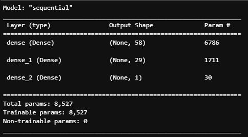
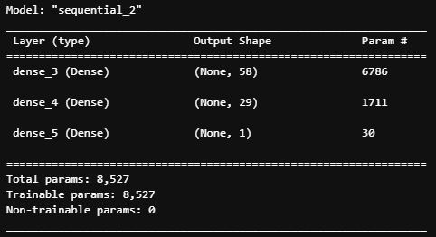
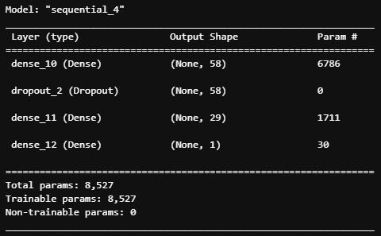

# Assignment---Module-13

## Overview of the Analysis

* The purpose of this assignment is to predict, using neural network models, whether an applicant requesting VC funding will be successful.

* The data provided contains more than 34,000 organizations that have received funding from Alphabet Soup over the years.

## Stages of the Process

   * I use OneHotEncoder() to encode the categorical variables in the dataset into numerical values
   * I use train_test_split on my X and y variables
   * I build a StandardScaler instance and transform the data
   * I build a Sequential model, adding layers, compiling and fitting
   * The Dropout() function is used
   * evaluations and metrics of models are shown using the evaluate() and summary() methods
   * models are saved as .h5 files, located in the Resources folder

## Results

### Original Neural Network Model:
  
  * 116 input features
  * 1 output neuron
  * 2 hidden layers
  * first hidden layer has 58 neurons
  * second hidden layer has 29 neurons
  * relu activation function is used on both hidden layers
  * sigmoid acitvation function is used on the output layer
  

  * compiling the model using binary_crossentropy function
  * optimizer "adam" is used
  * the model was run for 50 epochs

### Alternative 1 Neural Network Model:
  
  * 116 input features
  * 1 output neuron
  * 2 hidden layers
  * first hidden layer has 58 neurons
  * second hidden layer has 29 neurons
  * relu activation function is used on both hidden layers
  * sigmoid acitvation function is used on the output layer
  

  * compiling the model using binary_crossentropy function
  * optimizer "adam" is used
  * the model was run for 100 epochs

### Alternative 2 Neural Network Model:
  
  * 116 input features
  * 1 output neuron
  * 2 hidden layers
  * 1 Dropout layer after the first hidden layer
  * first hidden layer has 58 neurons
  * second hidden layer has 29 neurons
  * relu activation function is used on both hidden layers
  * sigmoid acitvation function is used on the output layer
  

  * compiling the model using binary_crossentropy function
  * optimizer "adam" is used
  * the model was run for 50 epochs

## Summary

Neither alternative models improved accuracy by any great degree. The Alternative Model 2 showed some slight accuracy improvement, from 0.730 in the original model to 0.732 in the Alternative 2 model.

In the Alternative 1 Model, where I ran the identical specification as the Original Model, but over 100 epochs, the accuracy decreased slightly from 0.730 to 0.729.

Loss was also roughly the same across all models.

